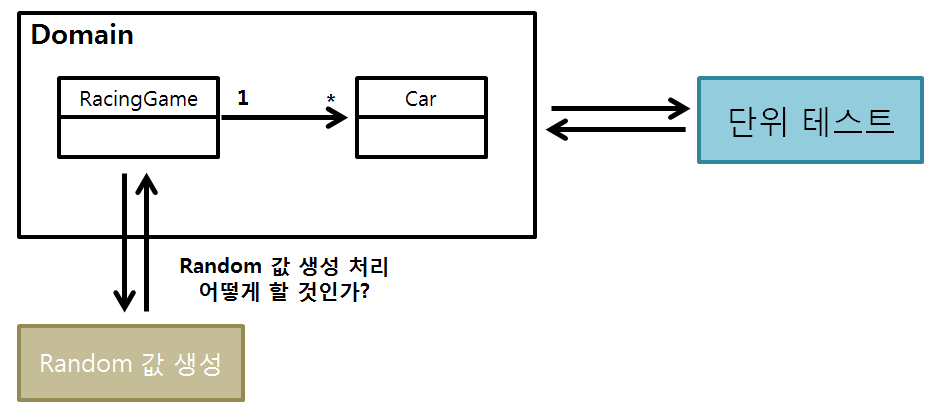

# 자동차 경주 게임
## 진행 방법
* 자동차 경주 게임 요구사항을 파악한다.
* 요구사항에 대한 구현을 완료한 후 자신의 github 아이디에 해당하는 브랜치에 Pull Request(이하 PR)를 통해 코드 리뷰 요청을 한다.
* 코드 리뷰 피드백에 대한 개선 작업을 하고 다시 PUSH한다.
* 모든 피드백을 완료하면 다음 단계를 도전하고 앞의 과정을 반복한다.

## 온라인 코드 리뷰 과정
* [텍스트와 이미지로 살펴보는 온라인 코드 리뷰 과정](https://github.com/next-step/nextstep-docs/tree/master/codereview)

---
## 3단계 - 자동차 경주 게임
## 1. 기능

1. 초간단 자동차 경주 게임을 구현한다.
2. 주어진 횟수 동안 n대의 자동차는 전진 또는 멈출 수 있다.
3. 사용자는 몇 대의 자동차로 몇 번의 이동을 할 것인지를 입력할 수 있어야 한다.
4. 전진하는 조건은 0에서 9 사이에서 random 값을 구한 후 random 값이 4이상일 경우이다.
5. 자동차의 상태를 화면에 출력한다. 어느 시점에 출력할 것인지에 대한 제약은 없다.

## 프로그래밍 요구사항

1. 모든 로직에 단위 테스트를 구현한다. 단, UI(System.out, System.in) 로직은 제외
2. 핵심 로직을 구현하는 코드와 UI를 담당하는 로직을 구분한다.
3. UI 로직을 InputView, ResultView와 같은 클래스를 추가해 분리한다.
4. 자바 코드 컨벤션을 지키면서 프로그래밍한다.
5. 참고문서: https://google.github.io/styleguide/javaguide.html 또는 https://myeonguni.tistory.com/1596
6. else 예약어를 쓰지 않는다.
   - 힌트: if 조건절에서 값을 return하는 방식으로 구현하면 else를 사용하지 않아도 된다.
   - else를 쓰지 말라고 하니 switch/case로 구현하는 경우가 있는데 switch/case도 허용하지 않는다.
   
---

## 4단계 - 자동차 경주(우승자)

## 기능

1. `InputView`에서 String 값으로 자동차 이름을 입력 받는다.
    - 자동차 이름은 쉼표(,)를 기준으로 구분한다.
2. 자동차(RacingCar) 이름 기능 추가
    - 각 자동차에 이름을 부여할 수 있다.
    - 자동차 이름은 5자를 초과할 수 없다.
3. `ResultView`의 출력 과정(`print()`)에서 자동차의 이름을 출력한다.
    - 전진하는 자동차를 출력할 때 자동차 이름을 같이 출력한다.
4. `RacingRound`는 누가 우승했는지 알 수 있다.
    - 누가 우승했는지 알 수 있도록 일급 컬렉션에서 기능을 구현한다.
5. **자동차 경주 게임을 완료한 후 누가 우승했는지를 알려준다. 우승자는 한명 이상일 수 있다.**

---

## 5단계 - 자동차 경주 리팩토링
## 요구사항

- 핵심 비지니스 로직을 가지는 객체를 domain 패키지, UI 관련한 객체를 view 패키지에 구현한다.

- MVC 패턴 기반으로 리팩토링해 view 패키지의 객체가 domain 패키지 객체에 의존할 수 있지만, 
domain 패키지의 객체는 view 패키지 객체에 의존하지 않도록 구현한다.

``` text
View   ------> Domain
Domain ---x--> View
```


- 테스트 가능한 부분과 테스트하기 힘든 부분을 분리해 테스트 가능한 부분에 대해서만 단위 테스트를 진행한다.



---

## 프로그래밍 요구사항

- **indent(인덴트, 들여쓰기) depth를 2를 넘지 않도록 구현한다. 1까지만 허용한다.**
   - 예를 들어 while문 안에 if문이 있으면 들여쓰기는 2이다.
   - 힌트: indent(인덴트, 들여쓰기) depth를 줄이는 좋은 방법은 함수(또는 메소드)를 분리하면 된다.
- **함수(또는 메소드)의 길이가 15라인을 넘어가지 않도록 구현한다.**
   - 함수(또는 메소드)가 한 가지 일만 잘 하도록 구현한다.
   - 모든 로직에 단위 테스트를 구현한다. 단, UI(System.out, System.in) 로직은 제외
   - 핵심 로직을 구현하는 코드와 UI를 담당하는 로직을 구분한다.
- UI 로직을 InputView, ResultView와 같은 클래스를 추가해 분리한다.
- **자바 코드 컨벤션을 지키면서 프로그래밍한다.**
   - https://google.github.io/styleguide/javaguide.html
   - https://myeonguni.tistory.com/1596
- else 예약어를 쓰지 않는다.
   - 힌트: if 조건절에서 값을 return하는 방식으로 구현하면 else를 사용하지 않아도 된다.
   - else를 쓰지 말라고 하니 switch/case로 구현하는 경우가 있는데 switch/case도 허용하지 않는다.

---


## 기능 목록 및 commit 로그

기능을 구현하기 전에 README.md 파일에 구현할 기능 목록을 정리해 추가한다.
git의 commit 단위는 앞 단계에서 README.md 파일에 정리한 기능 목록 단위로 추가한다.
참고문서: AngularJS Commit Message Conventions

